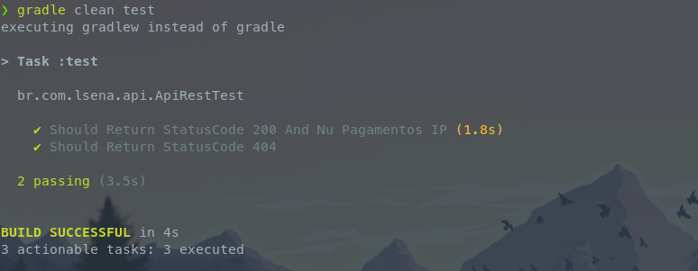

# Atividade Rest

Aula 1 "ESD21 - Automated Software Testing" - Atividade Rest

## Desafio

>Acesse o seguinte endereço:
>https://github.com/public-apis/public-apis

>- Escolha uma API para consumir, caso queira usar outra que não está na lista, pode mudar,
>desde que seja uma API pública
>- Crie um projeto com RestAssured e JUnit
>- Crie um teste de sucesso validando o http status code e o conteúdo retornado pela API com
>Assert
>- Crie um teste de falha validando o http status code com Assert
>- Subir o código no Github e enviar no classroom (atividade individual ou em grupo)

## Como rodar os testes

```sh
git clone https://github.com/luis-sena/automated-software-testing-atividade-rest.git && cd automated-software-testing-atividade-rest

gradle clean test
```


